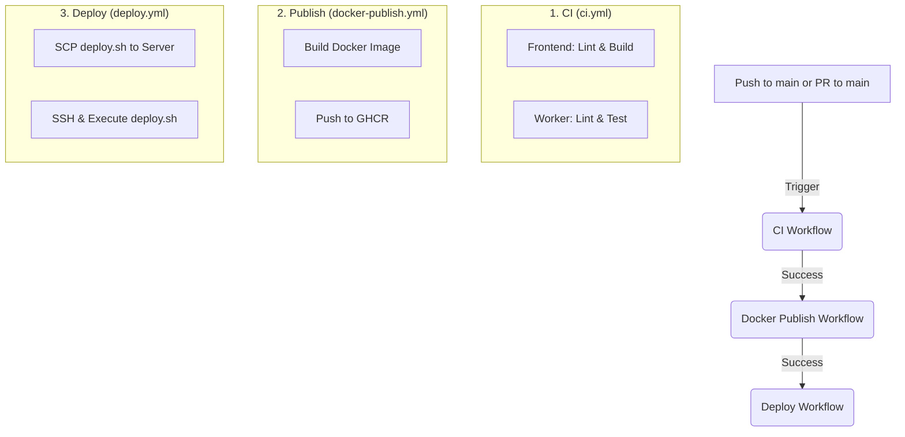

# CI/CD Workflow & Local Testing Guide

This project uses GitHub Actions for Continuous Integration (CI) and Continuous Deployment (CD). This document explains how the pipeline works and how to test each step locally.

## 1. CI/CD Pipeline Overview

The pipeline consists of three sequential workflows:



### Workflows

1.  **`ci.yml`**: Runs on:
    * `push` to `main`
    * `pull_request` targeting `main`
    * Frontend job: installs deps, runs ESLint, attempts a build.
    * Worker job: installs Python deps, installs Playwright Chromium, runs `flake8`, runs `pytest`.
2.  **`docker-publish.yml`**: Runs only after `ci.yml` succeeds for a `push` on `main`.
    *   Builds the Python worker Docker image.
    *   Publishes it to GitHub Container Registry (ghcr.io) with:
        * `latest`
        * full commit SHA (`github.event.workflow_run.head_sha`)
3.  **`deploy.yml`**: Runs only after `docker-publish.yml` succeeds.
    *   Copies `deploy.sh` to the production server.
    *   Connects via SSH and executes `deploy.sh`.
    *   **`deploy.sh`**: Logs into GHCR, pulls the specific full-SHA image, stops the old container, and starts the new one.

---

## 2. How to Test Locally

Before pushing code, you should verify these steps on your machine to avoid breaking the build.

### A. Testing the Frontend (Next.js)

1.  Navigate to repo root: `cd airahost/`
2.  **Install Deps**: `npm ci`
3.  **Lint**: `npm run lint`
4.  **Build**:
    ```bash
    # Mac/Linux
    NEXT_PUBLIC_SUPABASE_URL="https://mock.url" \
    NEXT_PUBLIC_SUPABASE_ANON_KEY="mock" \
    SUPABASE_SERVICE_ROLE_KEY="mock" \
    npm run build
    ```

### B. Testing the Worker (Python)

1.  Navigate to worker: `cd airahost/worker`
2.  **Install Deps**: `pip install -r requirements.txt pytest flake8`
3.  **Install Playwright Browser**: `playwright install chromium`
4.  **Lint**: `flake8 . --count --select=E9,F63,F7,F82 --show-source --statistics`
5.  **Test**:
    ```bash
    # Mac/Linux
    export PYTHONPATH=..:$PYTHONPATH
    pytest
    
    # Windows Powershell
    $env:PYTHONPATH = "..\;" + $env:PYTHONPATH
    pytest
    ```

### C. Testing Docker Build

Ensure your `Dockerfile` works and the directory structure is correct.

1.  Navigate to repo root: `cd airahost/`
2.  **Build**:
    ```bash
    docker build -t airahost-worker:local -f worker/Dockerfile ./worker
    ```
    *(Note: Context is `./worker` to match the CI environment)*

3.  **Run (Dry Run)**:
    To test if the container starts correctly (requires valid env vars):
    ```bash
    docker run --rm \
      -e SUPABASE_URL="https://your.supabase.co" \
      -e SUPABASE_SERVICE_ROLE_KEY="your-key" \
      airahost-worker:local
    ```

### D. Testing Deployment Logic

You can simulate the deployment script logic locally if you have Docker installed.

1.  **Set Env Vars** (Mock values):
    ```bash
    export GITHUB_REPOSITORY="your-org/airahost"
    export GITHUB_SHA="your-full-commit-sha"
    export GITHUB_TOKEN="ghp_xxx"
    export GITHUB_ACTOR="your-github-username"
    export CONTAINER_NAME="airahost-worker-test"
    export SUPABASE_URL="mock"
    export SUPABASE_SERVICE_ROLE_KEY="mock"
    export CDP_URL="mock"
    ```

2.  **Run logic manually**:
    ```bash
    IMAGE_NAME="ghcr.io/${GITHUB_REPOSITORY,,}/worker"
    IMAGE_TAG="${GITHUB_SHA}"

    # Login and pull (same as deploy.sh behavior)
    echo "${GITHUB_TOKEN}" | docker login ghcr.io -u "${GITHUB_ACTOR}" --password-stdin
    docker pull "${IMAGE_NAME}:${IMAGE_TAG}"

    # Stop old
    docker stop "$CONTAINER_NAME" || true
    docker rm "$CONTAINER_NAME" || true
    
    # Start new
    docker run -d \
      -p 8000:8000 \
      --name "$CONTAINER_NAME" \
      -e "SUPABASE_URL=${SUPABASE_URL}" \
      -e "SUPABASE_SERVICE_ROLE_KEY=${SUPABASE_SERVICE_ROLE_KEY}" \
      -e "CDP_URL=${CDP_URL}" \
      "${IMAGE_NAME}:${IMAGE_TAG}"
    ```

---

## 3. Configuration & Secrets

The pipeline relies on these GitHub Repository Secrets:

-   `DEPLOY_HOST`: Server IP/Hostname.
-   `DEPLOY_USERNAME`: SSH Username.
-   `DEPLOY_SSH_KEY`: Private SSH Key.
-   `SUPABASE_URL`, `SUPABASE_SERVICE_ROLE_KEY`, `CDP_URL`: App config.

`GITHUB_TOKEN` is provided automatically by GitHub Actions at runtime and is used by publish/deploy to access GHCR.
