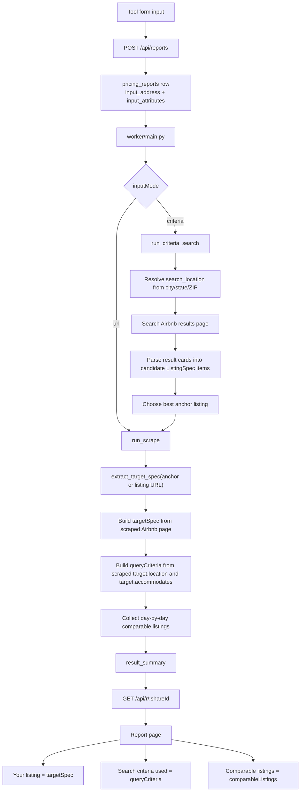
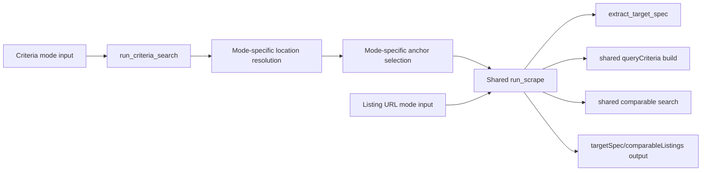

# BUG-001 Investigation - Criteria Mode Location Drift

This note documents the current code path behind `BUG-001` before any fix is
applied.

Update on `2026-04-09`: a fix has now been implemented in
`worker/scraper/price_estimator.py`, but it still needs live Airbnb rerun
verification.

## Case Under Review

User input in `Search by criteria` mode:

- City: `Belmont`
- State: `CA`
- ZIP: `94002-2216`
- Street: `933 Holly Rd`
- Property type: `Entire home`
- Bedrooms: `3`
- Bathrooms: `2`
- Max guests: `6`
- Start date: `2026-04-23`
- End date: `2026-04-25`

Observed report:

- Share URL: `https://www.airahost.com/r/nxn4fw5e`
- `Your listing` appears to be one scraped Airbnb listing, not the user input
- `Search criteria used` shows `Charlotte` instead of `Belmont`
- `Search criteria used` shows `8` guests instead of `6`
- Comparable listings are from Charlotte, not Belmont

Additional log observation:

- Worker log line:
  `https://www.airbnb.com/s/Belmont%2C%20CA/homes?checkin=2026-04-21&checkout=2026-04-23&adults=6`
- the worker was emitting `Belmont%2C%20CA` in the Airbnb search path
- user validation showed Airbnb resolves the correct market with `Belmont,CA`
  instead

## Short Answer

The bug is very likely caused by a shared pipeline boundary:

1. Criteria mode starts correctly from the user-entered address and attributes.
2. It searches Airbnb and picks one Airbnb listing as an anchor.
3. It then calls the URL-mode scraper on that anchor URL.
4. The shared URL-mode scraper rebuilds `targetSpec` and `queryCriteria` from
   the anchor listing itself.
5. The report UI renders those overwritten values directly.

That means criteria mode can accidentally "become" listing-URL mode after the
anchor handoff.

The new log observation changed the conclusion slightly:

- there is a real search-URL formatting issue in `build_search_url()`
- and there is also still a real criteria-to-anchor handoff issue after anchor
  selection

So `BUG-001` has two contributing causes:

1. incorrect Airbnb search path formatting for criteria location input
2. anchor listing metadata overwriting criteria-owned target metadata

## End-To-End Data Flow



## Where Each Report Section Comes From

### 1. How location is chosen in criteria mode

Primary entry point:

- [price_estimator.py](/Users/lambulandllc/Projects/Aira/airahost/worker/scraper/price_estimator.py)

Relevant flow:

1. `run_criteria_search()` reads structured fields from `attributes`:
   - `city`
   - `state`
   - `postalCode`
2. If `postalCode` exists, it geocodes the ZIP to canonical city/state and
   coordinates.
3. It builds `search_location` from the geocoded result, or falls back to
   `city, state`, or finally `_extract_search_location(address)`.
4. It creates an initial criteria-mode `query_criteria` with:
   - `locationBasis = search_location`
   - `searchAdults = maxGuests`
   - raw address and geocode metadata
5. It searches Airbnb using `build_search_url(base_origin, search_location, ...)`.

For the Belmont case, this code path should prefer Belmont because ZIP
`94002-2216` is present and the city/state are structured.

### 1a. About the logged `Belmont%2C%20CA` URL

The logged URL:

```text
https://www.airbnb.com/s/Belmont%2C%20CA/homes?checkin=2026-04-21&checkout=2026-04-23&adults=6
```

is equivalent to:

```text
https://www.airbnb.com/s/Belmont, CA/homes?...
```

The code originally produced this by calling `quote(location)` on the full path
segment. While that is technically valid URL encoding, user testing showed
Airbnb search resolves the intended market with:

```text
/s/Belmont,CA/homes
```

rather than:

```text
/s/Belmont%2C%20CA/homes
```

This means the URL format itself is part of the bug, not just the later anchor
handoff.

### 2. How `Your listing` is populated

The report UI does not infer this on the frontend. It renders whatever the
worker writes into `resultSummary.targetSpec`.

Frontend readers:

- [TargetSpecCard.tsx](/Users/lambulandllc/Projects/Aira/airahost/src/components/report/TargetSpecCard.tsx)
- [HowWeEstimated.tsx](/Users/lambulandllc/Projects/Aira/airahost/src/components/report/HowWeEstimated.tsx)
- [route.ts](/Users/lambulandllc/Projects/Aira/airahost/src/app/api/r/[shareId]/route.ts)

Worker source:

- [price_estimator.py](/Users/lambulandllc/Projects/Aira/airahost/worker/scraper/price_estimator.py)

In the shared scrape pipeline, `_build_daily_transparent_result()` writes
`targetSpec` from the current `target` object. That `target` comes from
`extract_target_spec(page, listing_url)`.

Implication:

- In URL mode, this is correct because `listing_url` is the user's own Airbnb
  listing.
- In criteria mode, after anchor selection, `listing_url` is the chosen Airbnb
  anchor listing, not the user's home.

That explains why `Your listing` can look like one of the comparable listings.

### 3. How `Search criteria used` is populated

The frontend renders `resultSummary.queryCriteria` directly.

Frontend readers:

- [QueryCriteriaCard.tsx](/Users/lambulandllc/Projects/Aira/airahost/src/components/report/QueryCriteriaCard.tsx)
- [HowWeEstimated.tsx](/Users/lambulandllc/Projects/Aira/airahost/src/components/report/HowWeEstimated.tsx)

Worker source:

- [price_estimator.py](/Users/lambulandllc/Projects/Aira/airahost/worker/scraper/price_estimator.py)

There are two different `query_criteria` builders:

1. Criteria-mode builder in `run_criteria_search()`
   - `locationBasis = search_location`
   - `searchAdults = user maxGuests`

2. Shared URL-mode builder in `run_scrape()`
   - `locationBasis = target.location`
   - `searchAdults = target.accommodates` if present

The second builder is what gets written into the final transparent result from
`run_scrape()`. In criteria mode, this means:

- `Belmont` can be replaced by the anchor listing location, such as `Charlotte`
- `6` guests can be replaced by the anchor listing capacity, such as `8`

This matches the bug report exactly.

### 4. How comparable listings are found

Comparable collection uses the shared scrape pipeline after the anchor handoff.

Flow:

1. `run_criteria_search()` chooses `best_match.url`
2. It calls `run_scrape(listing_url=best_match.url, ...)`
3. `run_scrape()` extracts `target.location` from that Airbnb listing page
4. Downstream day-by-day comparable search uses that scraped target context
5. Final comparable rows are written to `resultSummary.comparableListings`

Frontend readers:

- [ComparableListingsSection](/Users/lambulandllc/Projects/Aira/airahost/src/components/report/HowWeEstimated.tsx)
- [route.ts](/Users/lambulandllc/Projects/Aira/airahost/src/app/api/r/[shareId]/route.ts)

Implication:

- If the anchor listing is in the wrong city, the entire comparable market can
  shift to that city.
- Criteria mode is therefore vulnerable to location drift even if the initial
  `search_location` was correct.

## Shared Path vs Mode-Specific Path



Safe separation today:

- Criteria mode has its own location-resolution logic before anchor selection
- URL mode has its own direct listing extraction entry

Unsafe overlap today:

- After anchor selection, criteria mode enters `run_scrape()`
- `run_scrape()` assumes the provided URL is the real target listing
- `run_scrape()` writes target-derived fields into the final report without
  preserving criteria-mode originals

## Most Likely Root Cause

The most likely root cause is not the initial location extraction from the form.
That part appears reasonably structured and should handle the Belmont ZIP/city
combination well.

The higher-risk area is this criteria-to-URL handoff:

1. criteria mode correctly computes a target search location from the user input
2. criteria mode selects an Airbnb anchor listing
3. the shared URL pipeline treats the anchor listing as the target property
4. the report output then exposes anchor-derived values as if they were the
   original user criteria

That single design overlap can explain all three observed issues:

- wrong `Your listing`
- wrong `Search criteria used`
- wrong comparable geography

The new log evidence makes the root cause more specific:

- initial criteria-mode location resolution appears correct
- the later shared scrape handoff is what allowed Belmont to become Charlotte

## Implemented Fix

Implemented in:

- [price_estimator.py](/Users/lambulandllc/Projects/Aira/airahost/worker/scraper/price_estimator.py)

### What changed

1. `build_search_url()` now normalizes `City, State` to `City,State` and keeps
   the comma unescaped in the Airbnb path segment.
2. `run_scrape()` now accepts:
   - `target_spec_override`
   - `query_criteria_override`
3. `run_criteria_search()` now passes a synthetic user-owned target built from:
   - input address
   - geocoded / structured city and state
   - user-entered bedrooms / baths / guests / property type
4. During the second-pass scrape:
   - the anchor listing URL is still used as the scrape seed
   - but criteria mode no longer lets the anchor listing replace:
     - target location
     - target guest capacity
     - target structural attributes
     - final `queryCriteria`
5. Comparable repair logic that fetches listing-page metadata for incomplete
   comps is skipped when a criteria override is active, to avoid reintroducing
   anchor listing data into the criteria-mode target context.

### New behavior after the patch

Criteria mode should now behave like this:

```mermaid
flowchart TD
    A[Criteria input: Belmont, CA / 6 guests] --> B[run_criteria_search]
    B --> C[Search Airbnb and choose anchor URL]
    C --> D[run_scrape(anchor_url, target_spec_override=user_spec)]
    D --> E[Use anchor only for scrape seed and exclusion]
    D --> F[Use user_spec for target metadata, similarity, geo filter, day queries]
    F --> G[resultSummary.targetSpec stays user-owned]
    F --> H[resultSummary.queryCriteria stays criteria-owned]
    F --> I[Comparable search stays around Belmont]
```

## Fix Boundary Recommendation

When we fix this, criteria mode and URL mode should continue sharing the heavy
scrape machinery, but they should not share the same source of truth for
report-level target metadata.

Suggested boundary:

- Criteria mode should keep a criteria-owned target object derived from user
  inputs plus geocoded location
- Criteria mode may still use an anchor listing only for search seeding and
  comparable discovery
- URL mode should continue using scraped Airbnb listing data as the target
  source of truth

This is now the implemented design in code for criteria mode.

In practical terms, the safest future fix likely needs to preserve these three
criteria-mode fields from the pre-anchor stage:

- target listing display data for `targetSpec`
- original `queryCriteria`
- original target location / guest count used for comparable search constraints

## Files Most Relevant To The Future Fix

- [price_estimator.py](/Users/lambulandllc/Projects/Aira/airahost/worker/scraper/price_estimator.py)
- [target_extractor.py](/Users/lambulandllc/Projects/Aira/airahost/worker/scraper/target_extractor.py)
- [comparable_collector.py](/Users/lambulandllc/Projects/Aira/airahost/worker/scraper/comparable_collector.py)
- [main.py](/Users/lambulandllc/Projects/Aira/airahost/worker/main.py)
- [TargetSpecCard.tsx](/Users/lambulandllc/Projects/Aira/airahost/src/components/report/TargetSpecCard.tsx)
- [QueryCriteriaCard.tsx](/Users/lambulandllc/Projects/Aira/airahost/src/components/report/QueryCriteriaCard.tsx)
- [route.ts](/Users/lambulandllc/Projects/Aira/airahost/src/app/api/r/[shareId]/route.ts)

## Current Conclusion

Current conclusion after code review and patch:

- The initial criteria search URL format was part of the bug and has been
  patched to emit Airbnb-style city/state paths like `Belmont,CA`
- The criteria-to-anchor handoff was also part of the bug and has been patched
- Criteria mode now preserves its own target/search context while still using
  an anchor listing for scrape mechanics

Still pending:

- rerun live verification on the Belmont scenario to confirm the report now
  stays in Belmont and no longer drifts to Charlotte
